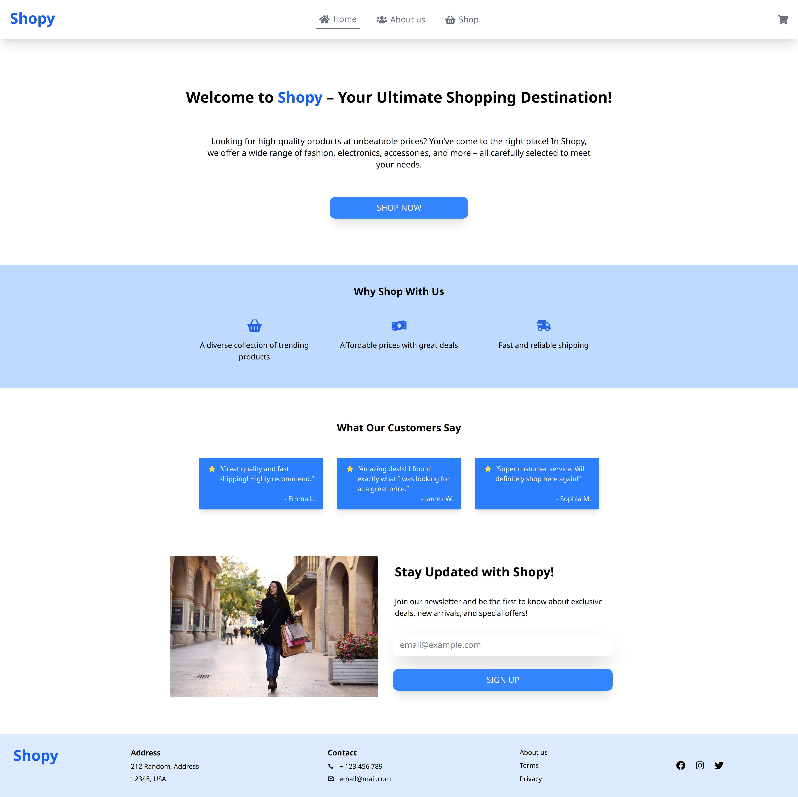
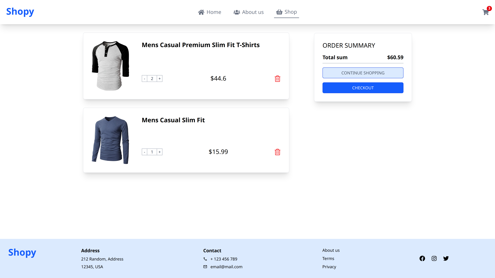

<h1>🛒 Shopy</h1>

Shopy is fake e-commerce with Home page, About us page and Shop page. It has working cart feature and it uses [Fake Store API](https://fakestoreapi.com/) to fetch products.

<h2>🚀 Used stack</h2>
<div align="left">
 
 
 
 
 
 
 
 
</div>

<h2>🚀 Demo</h2>

🔗 [Live demo](https://dawits-shopy.netlify.app/)  

<h2>📸 Screenshots</h2>

 
 
 
 
 


<h2>⚙️ Setup guide</h2>

1. Clone the repository

   ```bash
   git clone git@github.com:dawidtt/shopy.git
   cd ./Flashify
   ```

2. Install dependencies
      ```bash
     npm install
     ```
3. Run server
      ```bash
     npm run dev
     ```
      
  App will be available at http://localhost:5173

<h2>👨‍💻 Author</h2>

[Dawid Gorszka](https://github.com/dawidtt)
